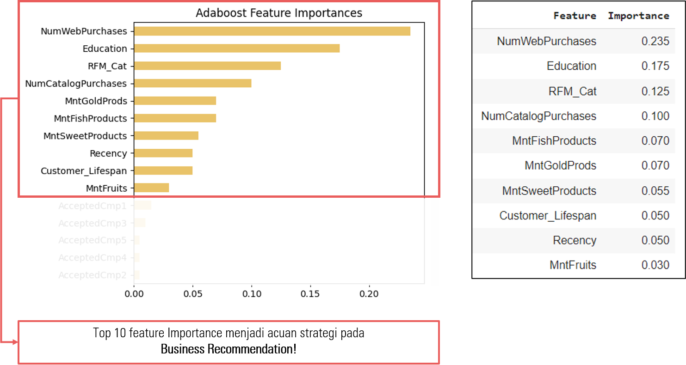

# Marketing Campaign Analysis

## Presented By:

### The Best Group of Final Project [🏆 Certificate of Awardee](images\awardee.png)

  

## Table of Contents

- [Business Understanding](#business-understanding)
- [Data Understanding](#data-understanding)
- [Data Preprocessing](#data-preprocessing)
- [Modelling and Evaluation](#modelling--evaluation)
- [Summary and Recommendation](#summary--recommendation)

---

## Business Understanding 🎯

### **Problem Statements :**

Sebuah perusahaan melaksanakan kampanye pemasaran, dimana kampanye pemasaran terakhirnya hanya berhasil meraih respons sebesar 14.91% dari 2240 pelanggan.

### **Objective:**

Membuat model prediktif untuk memprediksi response pelanggan

### **Business Metrics:**

Response Rate (Primary Metrics), Profit Margin (Secondary Metrics)

### **Goals:**

Merekomendasikan actionable business insight kepada tim Marketing dan Meningkatkan Response Rate dan Profit Margin dari marketing campaign

---

## Data Understanding 📋

### **Data Overview**

- Dimensi Data: `2240 baris, 29 kolom`
- Tipe Data: `26 Numerik, 3 Kategori`
- Missing Values: `1.07%`
- Duplicates: `8.12%`
- Outliers: `Year_Birth` dan `Income`
- Invalid Values: `Marital_Status` dan `Education`
- Invalid Tipe Data: `Dt_Customer`
- All Unique Values: `ID`, `Z_CostContact`, `Z_Revenue`

---

## Data Preprocessing 🛠️

### **Data Cleansing:**

1. Handling Missing Values: Drop missing values
2. Handling Duplicates: Drop Duplicates
3. Handling Outliers: Drop Outliers (Z-Score)
4. Handling Invalid Values: Replace values

### **Feature Engineering:**

1. Feature Extraction: RFM Cat, Customer Lifespan, Total Purchase, Total Spending, Total Offers, dll
2. Feature Encoding: Ordinal Encoding (Education, Marital Status), Label Encoding (RFM Cat, Relationship Status, Primary Needs)
3. Feature Transformation: 11 Feature Normalisasi (min-max scaler), 19 Feature Standarisasi (PowerTransformers) - Berdasarkan Nilai Kemiringan (Skew)
4. Feature Selection: ANOVA dan Chi-Square, VIF (Redundancy Feature)
5. Imbalance Handling: SMOTE, oversampling class 1 (1397:251 | 1397:1397)

---

## Modelling & Evaluation 🤖

### **Default Parameter**

**Default Parameter - Precision**

| Model                        | CV Precision       | Precision_Train    | Precision_Test     | Diff               | Diff (%)           |
| ---------------------------- | ------------------ | ------------------ | ------------------ | ------------------ | ------------------ |
| SVC                          | 0.799378           | 0.856226           | 0.836876           | 0.019350           | 2.259904           |
| XGBClassifier                | 0.847233           | 0.864785           | 0.827637           | 0.037148           | 4.295622           |
| **AdaBoostClassifier** | **0.872463** | **0.879967** | **0.822993** | **0.056974** | **6.474576** |

**Default Parameter - Accuracy**

| Model                        | CV Accuracy        | Accuracy_Train     | Accuracy_Test      | Diff               | Diff (%)           |
| ---------------------------- | ------------------ | ------------------ | ------------------ | ------------------ | ------------------ |
| SVC                          | 0.832502           | 0.852899           | 0.743119           | 0.109780           | 12.871371          |
| XGBClassifier                | 0.840023           | 0.864710           | 0.807339           | 0.057371           | 6.634668           |
| **AdaBoostClassifier** | **0.861142** | **0.879742** | **0.816514** | **0.063229** | **7.187166** |

Berdasarkan hasil evaluasi model, model adaboost akan digunakan sebagai model yang akan digunakan karena mempunyai CV Precision Score yang tinggi 87% dan FIT Rate yang masih di bawah 10% yakni 6.47%.

### **Hyperparameter Tuning**

**Hyperparameter Tuning - Precision**

| Parameter Set      | Model                        | CV Precision       | Precision_Train    | Precision_Test     | Diff               | Diff (%)           |
| ------------------ | ---------------------------- | ------------------ | ------------------ | ------------------ | ------------------ | ------------------ |
| **param_56** | **AdaBoostClassifier** | **0.908271** | **0.918675** | **0.843316** | **0.075359** | **8.203003** |
| param_55           | AdaBoostClassifier           | 0.903253           | 0.910859           | 0.831003           | 0.079856           | 8.767125           |
| param_52           | AdaBoostClassifier           | 0.900182           | 0.912634           | 0.822355           | 0.090279           | 9.892101           |

**Hyperparameter Tuning - Accuracy**

| Parameter Set      | Model                        | CV Accuracy        | Accuracy_Train     | Accuracy_Test      | Diff               | Diff (%)           |
| ------------------ | ---------------------------- | ------------------ | ------------------ | ------------------ | ------------------ | ------------------ |
| param_55           | AdaBoostClassifier           | 0.872244           | 0.910523           | 0.834862           | 0.075660           | 8.309532           |
| **param_56** | **AdaBoostClassifier** | **0.871889** | **0.918397** | **0.850917** | **0.067479** | **7.347494** |
| param_52           | AdaBoostClassifier           | 0.870808           | 0.912312           | 0.830275           | 0.082037           | 8.992193           |

---

## Summary & Recommendation

### **Business Simulation**

Menggunakan asumsi cost/promosi adalah **3 USD** dan revenue/promosi adalah **11 USD**, berikut simulasinya untuk menghitung profit margin.

|                | Sebelum Model | Sesudah Model |
| -------------- | ------------: | ------------: |
| Total Customer |          2240 |            60 |
| Total Response |           334 |            32 |
| Rate Accept    |        14.91% |        53.33% |
| Total Cost     |          6720 |           180 |
| Total Revenue  |          3674 |           352 |
| Total Profit   |         -3046 |           172 |
| Profit Margin  |       -82.91% |        48.86% |

### **Business Insight & Recommendation**

Berdasarkan hasil analisa, pelanggan dengan segmentasi loyal dan pelanggan dengan level pendidikan graduation adalah yang paling banyak proporsinya yakni **40% adalah pelanggan loyal** dan **53% adalah berpendidikan graduation**. Oleh sebab itu, 2 kategori ini menjadi target promosi dengan recency berkisar antara 32-46 hari dan customer lifespan 393-495 hari. Recency dan Customer Lifespan dihitung menggunakan *[confidence interval mean](https://www.investopedia.com/terms/c/confidenceinterval.asp)* (confidence level 95%).

## Dependencies

Daftar library dan versionnya yang digunakan [cek disini](requirements.txt)
