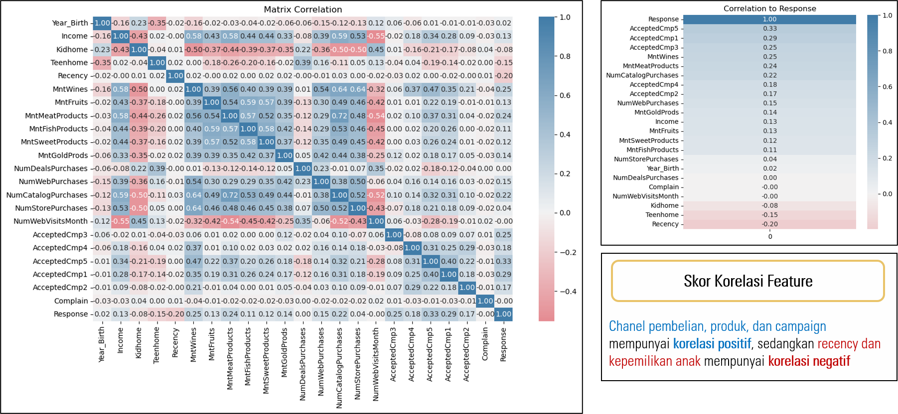

# Marketing Campaign Analysis

## Presented By:

### The Best Group of Final Project 🏆 | [Certificate of Awardee](images/awardee.png)

  

## Table of Contents

- [Business Understanding](#business-understanding)
- [Data Understanding](#data-understanding)
- [Data Preprocessing](#data-preprocessing)
- [Modelling and Evaluation](#modelling--evaluation)
- [Summary and Recommendation](#summary--recommendation)

---

## Business Understanding 🎯

### **Problem Statements :**

Sebuah perusahaan melaksanakan kampanye pemasaran, dimana kampanye pemasaran terakhirnya hanya berhasil meraih respons sebesar 14.91% dari 2240 pelanggan.

### **Objective:**

Membuat model prediktif untuk memprediksi response pelanggan

### **Business Metrics:**

Response Rate (Primary Metrics), Profit Margin (Secondary Metrics)

### **Goals:**

Merekomendasikan actionable business insight kepada tim Marketing dan Meningkatkan Response Rate dan Profit Margin dari marketing campaign

---

## Data Understanding 📋

### **Data Overview**

- Dimensi Data: `2240 baris, 29 kolom`
- Tipe Data: `26 Numerik, 3 Kategori`
- Missing Values: `1.07%`
- Duplicates: `8.12%`
- Outliers: `Year_Birth` dan `Income`
- Invalid Values: `Marital_Status` dan `Education`
- Invalid Tipe Data: `Dt_Customer`
- All Unique Values: `ID`, `Z_CostContact`, `Z_Revenue`

---

## Exploratory Data Analysis 📊

### **EDA**

#### **Univariate Analysis**

Mayoritas data terdistribusi secara positif, teen home dan kid home terdistribusi bimodal, dan hanya tahun kelahiran (`Year_Birth`) yang terdistribusi negatif.

Graduation dan Married adalah yang paling banyak diantara masing-masing kategori level pendidikan dan status perkawinan. Ada beberapa invalid values atau nilai yang tidak resmi, pada level pendidikan terdapat `2n Cycle` dan `Basic`, sedangkan pada status perkawinan ada `Alone`, `Absurd`, dan `YOLO`.

Grafik di atas menampilkan jumlah customer yang bergabung/pertama kali melakukan transaksi. Customer pertama melakukan transaksi di bulan Juli 2012, dan customer terakhir pada Juni 2014. Dengan kata lain, data ini mencakup sample dari customer yang melakukan transaksi 2 tahun sejak 2012.

Sedikit berbeda dengan grafik sebelumnya, grafik di atas membagi 2 segmen customer berdasarkan mereka yang menerima response pada marketing campaign. Terlihat bahwa jumlah yang tidak menerima campaign (garis `merah`) selalu lebih banyak di setiap bulannya bahkan jumlahnya lebih dari 2x. Ini menyebabkan label atau target customer yang akan digunakan dalam modelling menjadi imbalance.

#### **Multivariate Analysis**

Menampilkan korelasi (*correlation pearson*) positif antar feature. Feature yang terkait dengan kelompok produk seperti wine, daging, dll mempunyai korelasi yang kuat dengan satu kelompok sesamanya dan juga dengan kelompok channel pembelian atau promosi seperti toko, katalog, dan web. Ini menandakan bahwa ada keterkaitan antara promosi yang dilakukan pada channel tertentu dengan pembelian suatu produk. Sedangkan kelompok feature yang terkait dengan kepemilikan anak, mempunyai korelasi negatif yang cenderung lemah dengan berbagai feature dari kelompok produk, yang artinya kepemilikan anak mengurangi pembelian suatu produk.

### **Business Insight**

Lebih dari setengah dari responden yang memberikan response telah menerima setidaknya satu campaign (56.29%). Hal ini menunjukkan bahwa Campaign memainkan peran penting dalam meraih response positif dari customer. Terdapat potensi untuk meningkatkan kesuksesan campaign karena masih ada sekitar 43.71% responden yang memberikan Yes Responsee tanpa menerimaCampaign apa pun. Analisis lebih lanjut dapat dilakukan untuk memahami alasan di balik keputusan ini dan untuk memperbaiki strategi Campaign agar lebih menarik bagi customer.

Pemahaman tentang keberhasilan Campaign tertentu dapat membantu bisnis mengidentifikasi strategi yang efektif dan jenis Campaign yang lebih disukai oleh pelanggan. Misalnya, campaign 2 (Cmp2) memiliki tingkat kesuksesan yang tinggi (66.67%), sehingga strategi dari campaign 2 dapat dijadikan acuan untuk strategi campaign di masa mendatang.

Penting untuk melakukan segmentasi customer berdasarkan preferensi dan kebiasaan mereka terkait *acceptence* pada campaign. Dengan memahami kelompok pelanggan yang merespon campaign dengan baik dan kelompok yang tidak, untuk kedepannya dapat menyusun strategi yang lebih terarah dan personalisasi campaign sesuai dengan setiap segmen. Oleh sebab itu, faktor penting dari response campaign akan ditemukan pada model machine learning yang akan dibuat.

Pelanggan yang memberikan respons terhadap campaign memiliki rata-rata pendapatan yang lebih tinggi daripada yang tidak, periode pembelian (*recency*) yang lebih rendah, dan jumlah anak yang lebih sedikit. Customer yang merespons campaign menunjukkan tingkat pengeluaran yang lebih tinggi untuk berbagai kategori produk seperti daging dan wine. Berdasarkan dari insight tersebut, bisa disimpulkan bahwa mereka yang menerima campaign biasanya mempunyai pendapatan yang lebih tinggi, periode pembelian terakhir yang lebih cepat/rendah, mempunyai anak lebih sedikit, dan jumlah pembelian yang lebih banyak. Perlu analisa lebih lanjut dengan melakukan pemodelan machine learning, apakah faktor-faktor tersebut mempunyai kontribusi yang tinggi pada promosi. Dan perlu melakukan kalkulasi statistik, untuk memberikan rentang nilai rata-rata yang lebih baik misalnya menggunakan ***confidence mean interval***.

---

## Data Preprocessing 🛠️

### **Data Cleansing:**

1. Handling Missing Values: Drop missing values
2. Handling Duplicates: Drop Duplicates
3. Handling Outliers: Drop Outliers (Z-Score)
4. Handling Invalid Values: Replace values

### **Feature Engineering:**

1. Feature Extraction: RFM Cat, Customer Lifespan, Total Purchase, Total Spending, Total Offers, dll
2. Feature Encoding: Ordinal Encoding (Education, Marital Status), Label Encoding (RFM Cat, Relationship Status, Primary Needs)
3. Feature Transformation: 11 Feature Normalisasi (min-max scaler), 19 Feature Standarisasi (PowerTransformers) - Berdasarkan Nilai Kemiringan (Skew)
4. Feature Selection: ANOVA dan Chi-Square, VIF (Redundancy Feature)
5. Imbalance Handling: SMOTE, oversampling class 1 (1397:251 | 1397:1397)

RFM Cat merupakan salah feature baru yang diekstrak dari beberapa feature seperti recency, frequency (total transaksi di kelompok feature channel pembelian), dan monetary (total spending di kelompok feature produk). Membagi menjadi 4 segmentasi customer, yang di kalkulasi menggunakan nilai dari quartile masing-masing feature pembentuk. New customer adalah customer dengan recency pembelian paling lama, total frekuensi transaksi terendah, dan jumlah spending terendah, sedangkan lainnya ada at risk customer, loyal customer, dan tertinggi adalah champions.

Terdapat 28 feature dari 33 feature yang lolos uji anova dengan confidence level di 95%. Uji Anova digunakan untuk melihat apakah ada perbedaan signifikan antara feature yang mempengaruhi (independent features) dengan feature yang dipengaruhi / target (dependent feature), dimana feature dependent adalah numerik dan target adalah kategori..

Terdapat 3 feature dari 5 feature yang lolos uji Chi Square dengan confidence level di 95%. Uji Chi Square digunakan untuk melihat apakah ada perbedaan signifikan antara feature yang mempengaruhi (independent features) dengan feature yang dipengaruhi / target (dependent feature), dimana feature dependent adalah kategori dan target adalah kategori.

Setelah melalui tahapan 2 uji statistik, selanjutnya melakukan redundacy analysis. Redundacy Analysis digunakan untuk mengoptimalkan kinerja pemodelan, mereduksi feature-feature yang mempunyai kemiripan atau saling berkorelasi satu sama lain (multicolinearity). Metode yang digunakan adalah `VIF Score`, metode ini biasanya digunakan dalam pemodelan regresi dan tidak lazim pada kasus klasifikasi, namun pada kasus klasifikasi ini masih applicable karena hubungan feature dan target linear. Apabila menggunakan algoritma model ensemble, sebenarnya tidak perlu melakukan redudancy analysis, karena akan otomatis terseleksi. Namun untuk mengoptimalkan resource dan mempercepat kinerja pemodelan sebaiknya feature yang digunakan tidak terlalu banyak, oleh sebab itu hal ini sangat direkomendasikan.

---

## Modelling & Evaluation 🤖

### **Default Parameter**

**Default Parameter - Precision**

| Model                        | CV Precision       | Precision_Train    | Precision_Test     | Diff               | Diff (%)           |
| ---------------------------- | ------------------ | ------------------ | ------------------ | ------------------ | ------------------ |
| SVC                          | 0.799378           | 0.856226           | 0.836876           | 0.019350           | 2.259904           |
| XGBClassifier                | 0.847233           | 0.864785           | 0.827637           | 0.037148           | 4.295622           |
| **AdaBoostClassifier** | **0.872463** | **0.879967** | **0.822993** | **0.056974** | **6.474576** |

**Default Parameter - Accuracy**

| Model                        | CV Accuracy        | Accuracy_Train     | Accuracy_Test      | Diff               | Diff (%)           |
| ---------------------------- | ------------------ | ------------------ | ------------------ | ------------------ | ------------------ |
| SVC                          | 0.832502           | 0.852899           | 0.743119           | 0.109780           | 12.871371          |
| XGBClassifier                | 0.840023           | 0.864710           | 0.807339           | 0.057371           | 6.634668           |
| **AdaBoostClassifier** | **0.861142** | **0.879742** | **0.816514** | **0.063229** | **7.187166** |

Berdasarkan hasil evaluasi model, model adaboost akan digunakan sebagai model pada production karena mempunyai CV Precision Score yang tinggi 87% dan FIT Rate yang masih di bawah 10% yakni 6.47%.

### **Hyperparameter Tuning**

**Hyperparameter Tuning - Precision**

| Parameter Set      | Model                        | CV Precision       | Precision_Train    | Precision_Test     | Diff               | Diff (%)           |
| ------------------ | ---------------------------- | ------------------ | ------------------ | ------------------ | ------------------ | ------------------ |
| **param_56** | **AdaBoostClassifier** | **0.908271** | **0.918675** | **0.843316** | **0.075359** | **8.203003** |
| param_55           | AdaBoostClassifier           | 0.903253           | 0.910859           | 0.831003           | 0.079856           | 8.767125           |
| param_52           | AdaBoostClassifier           | 0.900182           | 0.912634           | 0.822355           | 0.090279           | 9.892101           |

**Hyperparameter Tuning - Accuracy**

| Parameter Set      | Model                        | CV Accuracy        | Accuracy_Train     | Accuracy_Test      | Diff               | Diff (%)           |
| ------------------ | ---------------------------- | ------------------ | ------------------ | ------------------ | ------------------ | ------------------ |
| param_55           | AdaBoostClassifier           | 0.872244           | 0.910523           | 0.834862           | 0.075660           | 8.309532           |
| **param_56** | **AdaBoostClassifier** | **0.871889** | **0.918397** | **0.850917** | **0.067479** | **7.347494** |
| param_52           | AdaBoostClassifier           | 0.870808           | 0.912312           | 0.830275           | 0.082037           | 8.992193           |

---

## Summary & Recommendation

### **Business Simulation**

Menggunakan asumsi cost/promosi adalah **3 USD** dan revenue/promosi adalah **11 USD**, berikut simulasinya untuk menghitung profit margin.

|                | Sebelum Model | Sesudah Model |
| -------------- | ------------: | ------------: |
| Total Customer |          2240 |            60 |
| Total Response |           334 |            32 |
| Rate Accept    |        14.91% |        53.33% |
| Total Cost     |          6720 |           180 |
| Total Revenue  |          3674 |           352 |
| Total Profit   |         -3046 |           172 |
| Profit Margin  |       -82.91% |        48.86% |

### **Business Insight & Recommendation**

Berdasarkan hasil analisa, pelanggan dengan segmentasi loyal dan pelanggan dengan level pendidikan graduation adalah yang paling banyak proporsinya yakni **40% adalah pelanggan loyal** dan **53% adalah berpendidikan graduation**. Oleh sebab itu, 2 kategori ini menjadi target promosi dengan recency berkisar antara 32-46 hari dan customer lifespan 393-495 hari. Recency dan Customer Lifespan dihitung menggunakan *[confidence interval mean](https://www.investopedia.com/terms/c/confidenceinterval.asp)* (confidence level 95%).

## Dependencies

Daftar library dan versionnya yang digunakan [cek disini](requirements.txt)
